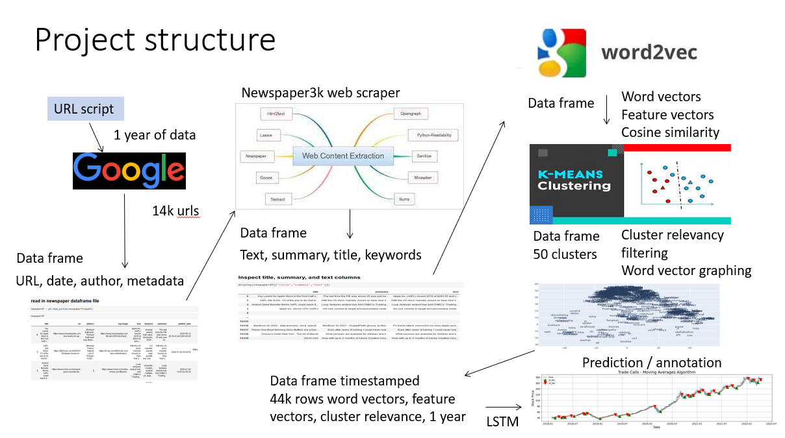

# README_Project_structure

This readme file explains the structure of the jupyter notebook structure, the progression of how the scripts are run, the files and directories created, and how the notebooks support the work of the project.

# Structure of the project

##### The project is divided into stages to keep the concepts of what is being done separated and scripts associated with the effort kept together by type.

### The top level directory holds the readme files explaining aspects of the project.

##### README.md

This file explains the project objectives

##### Johnny_Data606_Approved_Proposal.md
This file explains the approved proposal from the beginning of the class

##### Johnny_Data606_draft_proposal.md
This file explains the draft proposal as it was designed at the beginning of the class

# Python Jupyter Notebook explanation

The notebooks are stored in directories and are run in the following order:

##### Google_Search 
This directory is the beginning of the project.
The script query_google_for_urls_working_20220304  in this directory queries the search terms from google and records the search terms in files in the Google_Search / Googlesearch_scripts directory.
        
This script was extremely difficult to research and get working.  Google does not allow robots willingly.  There are rate limits in place that terminate queries, return errors, and sanction the script from receiving results.  
        
This script is a successfull implementation of getting urls returned.  The number of urls returned is also extrelemt limited.  This script used a process of issuing queries requesting documents that were published on a particular date.  These results were stored in a dataframe with the query requirement dates .  This provides a method to attribute dates to the publication if the internal publication dates are not provided in metadata when the document is downloaded later. 

##### newspaper3k

The newspaper_parsing_script in this directory reads in the google url files from the G Google_SearchGooglesearch_scripts directory.  This then uses the newspaper3k library to download the documents, parse them, and store the results in a dataframe in the newspaper3k directory.  The data file is dated to support successive runs.  

##### Word2vec

The word2vec newspaper from pkl script in this directory is a powerhouse script.  This script reads the newspaper files from the newspaper dicetory and produces a series of pickled data frame files as well as pickled model files of the word2vec models.  
	
It was not clear to me when I was processing these articles, what data I would need to keep.  So I kept each of the following data from each file in a dataframe column:  Title, summary, text, and keywords.  Each of these were processed in this script and the word vectors were stored in new columns for each document.  These were then processed into feature vectors to create a new column for each of title, summary, text, and keywords.  

This script also performs kmeans clustering on the feature vectors and generates a cluster tage for the documents attributing the documents to particular clusters.  This was perfomed independendtly for each of the title, text, summary, and keyword columns.  So in each context there is a cluster relationship to consider. 
    
Each of the data frames, word2vec models, and kmeans models were stored as pickle files.  The script employs a dictionary of models data structure for the mkmeans models and word2vec models.  This makes the processing of vocabulary models distinct and the code is usable to switch contexts between either of the contexts of title, subject, text, or keywords.  
    
Clustering evaluation was performed in this script.  The individual clusters were made explorable by developing an analyst interface in the notebook.  A section of the notebook was provided for an analyst to examine the content of the clusters and to provide an interface for the analyst to communicate wether the cluster was relevant or not.  The analyst would annotate the cluster number in an array if it was relevant.  The analyst would go through each of the 50 clusters for each of the contexts, and determine if the content was relevant to the purpose.  In this case the relevance was if the content expressed things regarding stock price, the company, or products. 
    
These relevance arrays were then processed and a relevance column of 0 or 1 was annotated for each document.   

##### Clustering evaluation

The Cluster_processing script reads in the word2vec pickle data frame from the large file directory.  This directory was required since the file size of the file was too large to be uploaded into github for this project.  I have since paid for github's large file storage account (LFS) and can upload the project.  
    
This script also reads in the word2vec models and kmeans cluster models into a dictionary of models data structure.  This makes the data elements accessible.  
    
Graphic processing of the word vectors is provided in this script as well using plotly and matplotlib.  
    
To support plotting the dimansionality of the word vectors was reduced using TNSE library.  A vocabulary dataframe was constructed with the vocabulary as label and x and y coordinates from the tnse library of the word2vec word vectors. Then a simple filter process selects the label, x and y coordinates to support scatter plotting.  
    
##### stock price

There are several scriopts in the stock_price  directory. 
    
sentiment_analysis_stock_ticker_annotation_5_day_weighted_average_prediction.ipynb compares the prediction capability of LSTM to 5 day weighted average with annotations of sentiment.  
    
Priceprediction.ipnb explores LSTM price prediction.  This works quite well.  
    
LSTM work very well to predict the price.  Just as well as the 5 day weighted average.  But that could be a factor of over fitting. The annaotations of semantics and sentiment or events on the changes in direction can be very informative.  

##### Class documents

This directory contains the power point presentations for the class.  

## Supporting Directories
Some of the scripts are to develop methods and are kept as learning resources for coding examples

#####  topic modeling
This directory contains topic modeling scripts to evaluate key word analysis from articles

#####  user_interface
This directory explores various user interface methods
 
#####  EDA
This directory expresses some of the exploratory data analysis processes at the beginning of the project

#####  Keyword_Search_Term_Volume
This directory explores scripting to evaluate keyword searches for the google search component

#####  RSS_feeds
This directory explores the concepts of using the newspaper3k script to explore rss feeds

