# Stock Price Prediction

# Semantic and sentiment analysis

---

DATA 606

	Capstone in Data Science

	Spring 2022

	Instructor: 	Dr. Chaojie (Jay) Wang	

	Johnny Morgan

	20220413

---
## Project focus narrows from price prediction to source evaluation

As price prediction was performed and LSTM price prediction was evaluated.  It became clear that the price predictions were fully capable of predicting price using the price fluctuations alone without aid of sentiment or semantic enrichment.  However 5 day moving averages were just as reliable a predictor and is already a standard prediction methodology.  

---

The semantic technology using word2vec word embeddings or word vectors was extremely interesting in that the challenges of filtering the data for relevancy were significantly useful. So if the semantic work was not useful in predicting price changes they __will__ be useful in annotating price changes with some form of causality, influence, or other form of explanation.

The technology of word vectors provides capabilities that were useful in this effort supporting relevancy analysis and filtering based on word vector based feature vectors.  These are feature reductions where all of the word vectors in a document are averaged.  The resulting feature vector is a representation of the entire sentence/document.  These documents can be compared using these feature vectors and evalyuated for relevancy by an analyst or a process. 

This provides a basis for evaluation of topic domains and intent modeling.  

# Project structure

# Data Sources

# project sections
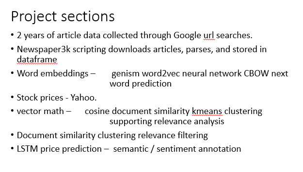
# price prediction semanic analysis

# What is it?
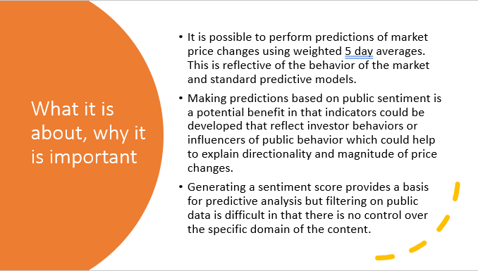
# ML Models
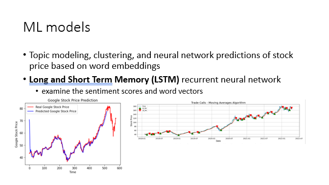

# Explainability in predictions 
### what does semantic and sentiment analyis add to stock price prediction methodology?

# So What?

# Original intent
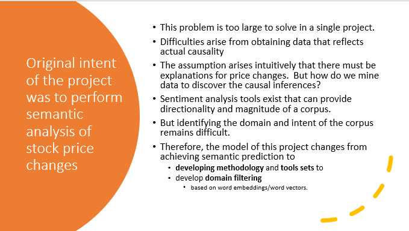
# Word vector analysis
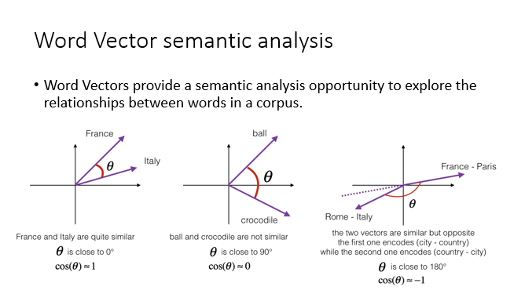
# Cosine similarity clustering

# Relevancy analysis using clustered feature vectors of news articles
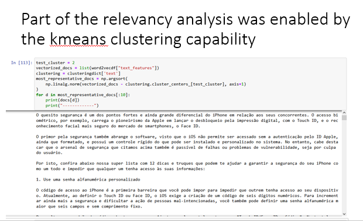
# Licensing statement cluster
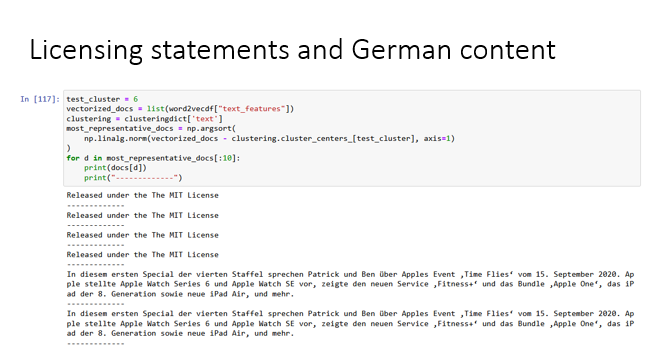
# dimensional relationships of company names and stock symbols
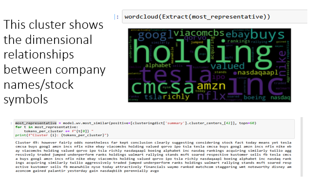
# stock price cluster
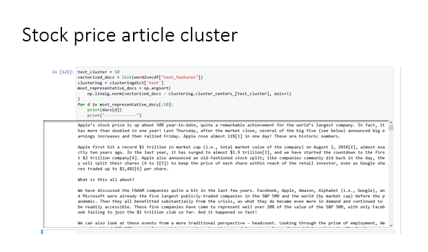
# Product information cluster

# vocabulary plots dimension reduction
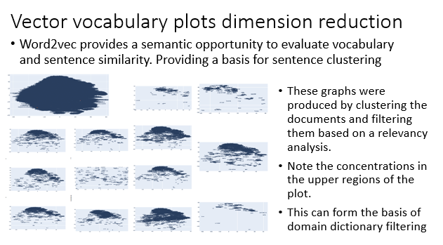
# Full corpus plot
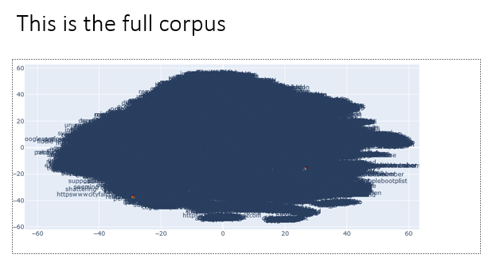
# domain filtering benefit
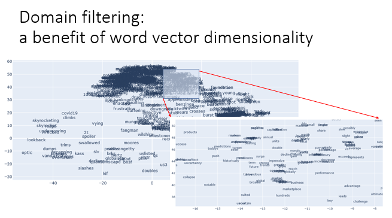
# research question exploring word vector dimensionality
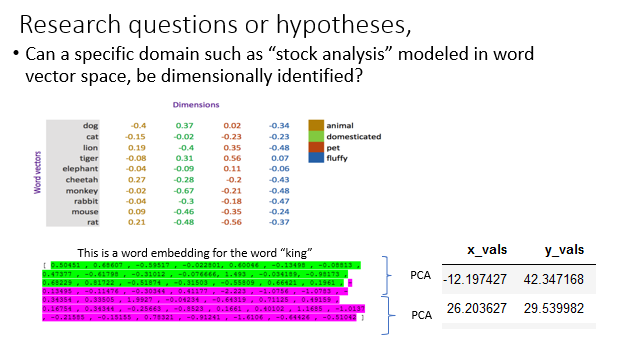
# research process steps

# discovering the meaning of word vector dimensions

# expected outcomes
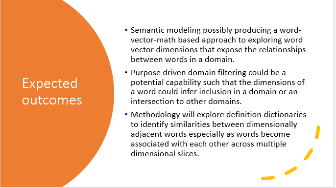

