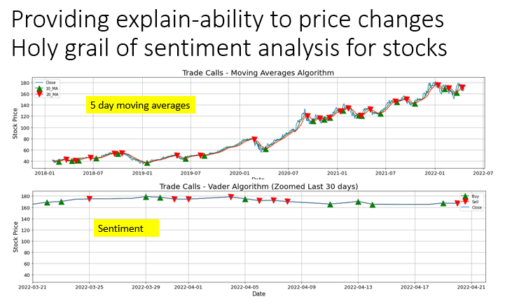
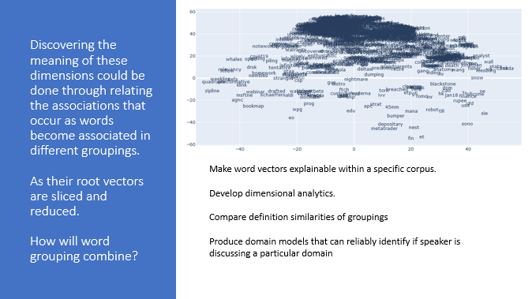
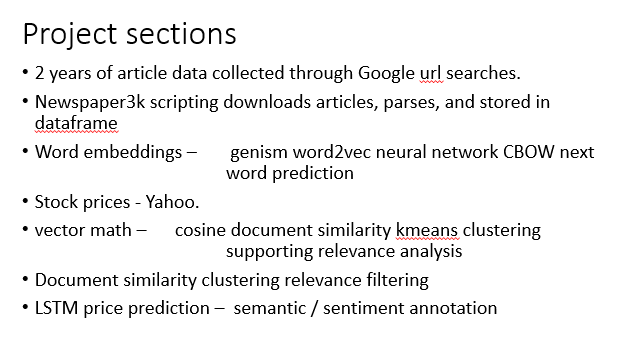
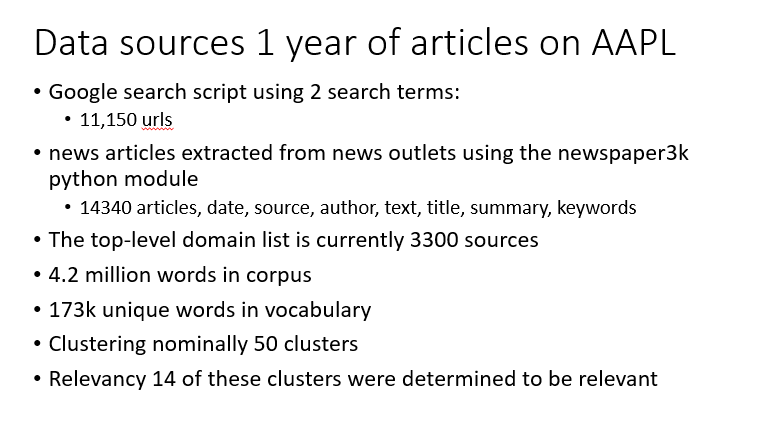

# Stock Price Prediction

# Semantic and sentiment analysis

---

DATA 606

	Capstone in Data Science

	Spring 2022

	Instructor: 	Dr. Chaojie (Jay) Wang	

	Johnny Morgan

	20220413

---
## Project focus narrows from price prediction to source evaluation

As price prediction was performed and LSTM price prediction was evaluated.  It became clear that the price predictions were fully capable of predicting price using the price fluctuations alone without aid of sentiment or semantic enrichment.  However 5 day moving averages were just as reliable a predictor and is already a standard prediction methodology.  

---

The semantic technology using word2vec word embeddings or word vectors was extremely interesting in that the challenges of filtering the data for relevancy were significantly useful. So if the semantic work was not useful in predicting price changes they __will__ be useful in annotating price changes with some form of causality, influence, or other form of explanation.

The technology of word vectors provides capabilities that were useful in this effort supporting relevancy analysis and filtering based on word vector based feature vectors.  These are feature reductions where all of the word vectors in a document are averaged.  The resulting feature vector is a representation of the entire sentence/document.  These documents can be compared using these feature vectors and evalyuated for relevancy by an analyst or a process. 

project_structure.PNG
expected outcomes.PNG
discovering_meaning_in_the_dimensions.PNG
research_process_slide.PNG
research_question_slide.PNG
domain_filtering_slide.PNG
full_corpus_slide.PNG
vocabulary_plots_dimension_reduction.PNG
product_information_slide.PNG
stock_price_cluster_slide.PNG
dimensional_relationships_company_stock_names_symbols.PNG
licensing_statements_slide.PNG
part_of_relevancy_analysis_slide.PNG
cosine_similarity_slide.PNG
word_vector_slide.PNG
original_intent_slide.PNG
so_what_slide.PNG
ml_models_slide.PNG
what_is_it_slide.PNG
price_prediction_semantic_analysis_slide.PNG

